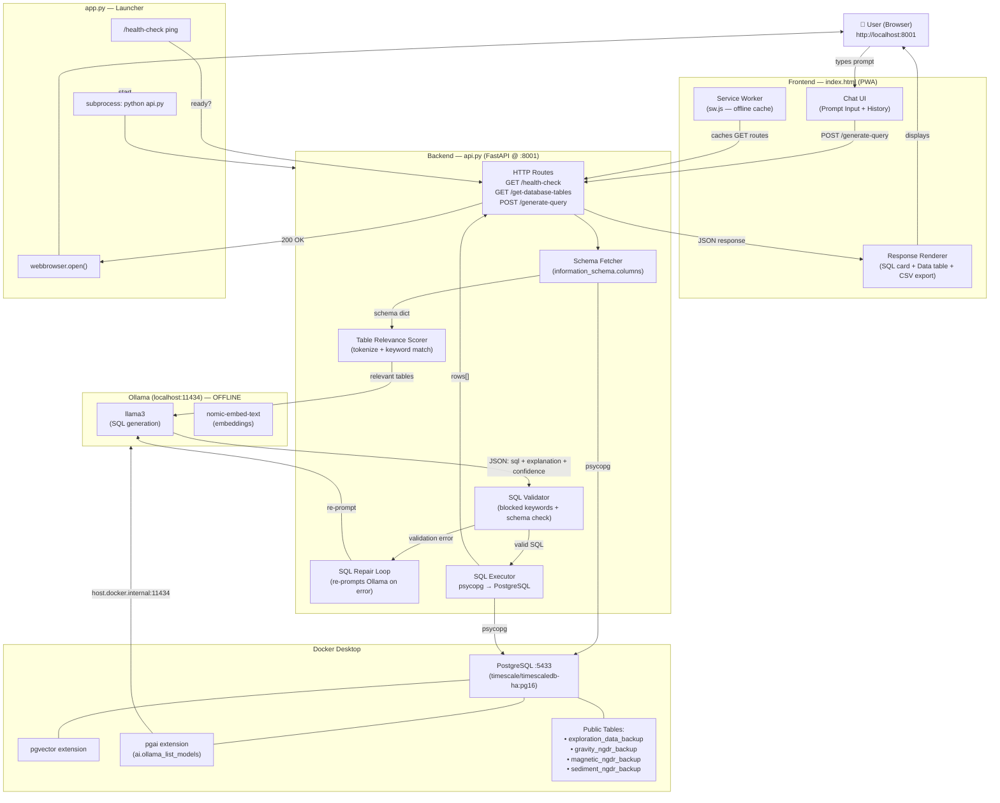
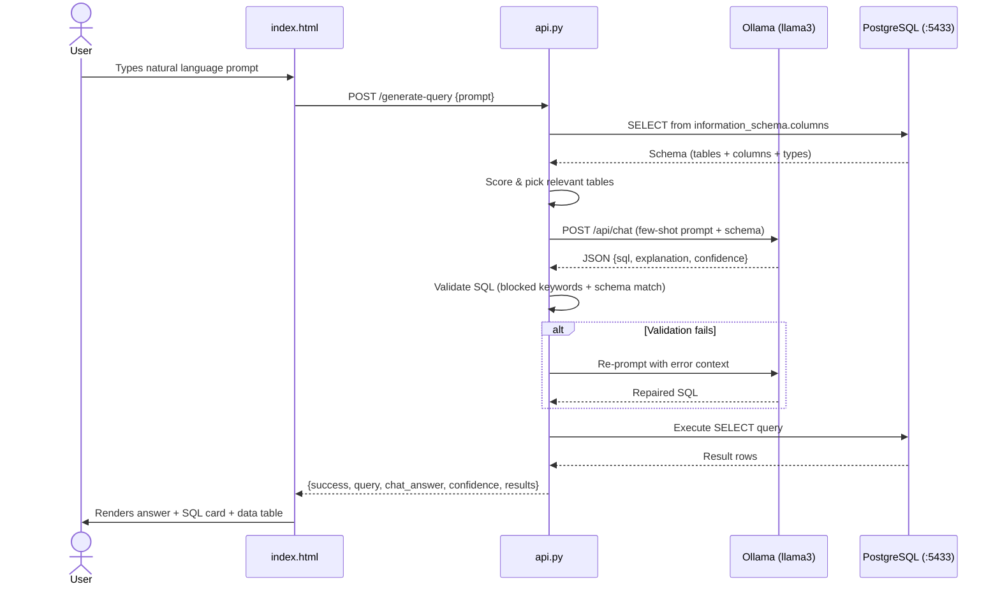

# PG AI Query Engine v4.0
**Natural Language → SQL | Powered by Ollama llama3 | Fully Offline**

> Ask questions in plain English. Get SQL-generated answers from your PostgreSQL database — no internet required.

---

## Architecture Overview



---

## System Components

### `app.py` — Launcher
The entry point. Pings `/health-check` to see if the server is already up. If not, spawns `api.py` as a subprocess, waits up to 30 seconds for it to become ready, then auto-opens the browser.

### `api.py` — FastAPI Backend
The core engine running on `http://0.0.0.0:8001`. Handles all logic: DB schema introspection, AI prompt construction, SQL validation, SQL execution, and JSON response assembly.

**Key routes:**

| Method | Route | Description |
|--------|-------|-------------|
| `GET` | `/health-check` | Checks DB, Ollama, pgai, and model availability |
| `GET` | `/get-database-tables` | Returns full schema (table → columns → types) |
| `POST` | `/generate-query` | Main endpoint: NL prompt → SQL → results |
| `GET` | `/` | Serves `index.html` |
| `GET` | `/manifest.json` | PWA manifest |
| `GET` | `/sw.js` | Service Worker |

**SQL generation pipeline (`/generate-query`):**
1. Fetch DB schema from PostgreSQL
2. Score and pick relevant tables (keyword + token matching)
3. Build a few-shot prompt with SQL examples and focused schema
4. Call Ollama llama3 → parse JSON response (`sql`, `explanation`, `confidence`)
5. Validate SQL (blocked keywords, column/table existence check, intent match)
6. If invalid → repair loop: re-prompt Ollama with the error (up to 2 retries)
7. Execute valid SQL via psycopg
8. Return rows + explanation + confidence score to frontend

**Safety — blocked SQL keywords** (read-only enforcement):
`INSERT`, `UPDATE`, `DELETE`, `DROP`, `TRUNCATE`, `ALTER`, `GRANT`, `REVOKE`, `CREATE`, `REPLACE`, `EXEC`, `EXECUTE`, `CALL`

### `index.html` — Frontend PWA
A single-file Progressive Web App with:
- **Chat interface** — message history, typing indicator, AI/user avatars
- **SQL card** — shows generated SQL with one-click copy
- **Data table** — paginated results (first 100 rows), CSV export
- **Confidence pill** — color-coded (green > 80%, amber > 50%, red otherwise)
- **Sidebar** — live DB/Ollama/model status, query history, example chips
- **Dark/Light theme** toggle
- **XSS-safe** — all DB/user strings escaped via `escapeHtml()`

### `sw.js` — Service Worker
Caches static assets (`/`, `/index.html`, `/manifest.json`, `/sw.js`) and GET API responses (`/get-database-tables`, `/health-check`) for offline fallback. POST requests (`/generate-query`) always go live.

### `manifest.json` — PWA Manifest
Enables "Add to Home Screen" on mobile/desktop. Theme color: `#8b5cf6` (violet).

---

## Request Lifecycle



---

## Prerequisites

### 1. Docker — pgai container
```bash
docker run -d \
  --name pgai \
  -e POSTGRES_PASSWORD=postgres \
  -p 5433:5432 \
  timescale/timescaledb-ha:pg16
```

> If you use a **different password**, set the env var:
> `export DB_PASSWORD=yourpassword`

### 2. Ollama — pull required models
```bash
# Install Ollama: https://ollama.com
ollama pull llama3
ollama pull nomic-embed-text
```

### 3. Python dependencies
```bash
pip install fastapi uvicorn psycopg[binary] requests pydantic
```

---

## Running the App

```bash
# Option A — launcher (opens browser automatically)
python app.py

# Option B — direct
python api.py
# then open http://localhost:8001
```

---

## Environment Variables

| Variable | Default | Description |
|---|---|---|
| `DB_HOST` | `localhost` | PostgreSQL host |
| `DB_PORT` | `5433` | PostgreSQL port |
| `DB_NAME` | `postgres` | Database name |
| `DB_USER` | `postgres` | Database user |
| `DB_PASSWORD` | `postgres` | Database password |
| `OLLAMA_MODEL` | `llama3` | SQL generation model |
| `OLLAMA_EMBED_MODEL` | `nomic-embed-text` | Embedding model |
| `OLLAMA_BASE_URL` | `http://127.0.0.1:11434/api/chat` | Ollama chat endpoint |
| `PGAI_OLLAMA_HOST` | `http://host.docker.internal:11434` | Ollama host as seen from inside Docker |
| `PGAI_CATALOG_TABLE` | `ai_semantic_catalog` | pgai semantic catalog table |

---

## Database Tables

The app is pre-configured with SQL examples for these tables (Indian geoscience/NGDR data):

| Table | Domain | Key Columns |
|---|---|---|
| `exploration_data_backup` | Mineral exploration | `district_name`, `commodity`, `exploration_stage`, `project_title` |
| `gravity_ngdr_backup` | Gravity surveys | `observed_gravity`, `bouguer_anomaly`, `theoritic_anomaly` |
| `magnetic_ngdr_backup` | Magnetic surveys | `observed_magnetic`, `igrf`, `magnetic_anomaly` |
| `sediment_ngdr_backup` | Sediment geochemistry | `silicon_dioxide`, `aluminium_oxide`, `copper`, `nickel` |

---

## Troubleshooting

**"Cannot reach Ollama"**
```bash
ollama serve          # start Ollama
ollama list           # verify llama3 and nomic-embed-text are listed
```

**DB connection error**
```bash
docker ps             # confirm pgai container is running
docker logs pgai      # check for errors
```

**Model not ready**
```bash
ollama pull llama3
ollama pull nomic-embed-text
```

**Server did not start within 30s**
Run `python api.py` directly and check the terminal for startup errors.

---

## Changelog — v3 → v4

| Area | v3 | v4 |
|---|---|---|
| DB Port | `5432` | `5433` (Docker mapping) |
| AI Model | `qwen2.5-coder:1.5b` | `llama3` |
| Health check | No model info | Checks llama3 + nomic-embed-text |
| UI status badge | Always "Connected" | Live ping every 30s |
| Sidebar | No system info | Live DB / Ollama / model status |
| SQL display | Hidden | Shown with confidence % pill |
| Example chips | None | Clickable queries from schema |
| `app.py` startup | Checked `/get-database-tables` | Checks `/health-check` (correct) |
| `sw.js` cached routes | `/generate-query` (POST — wrong) | Only GET routes cached |
| XSS safety | Raw innerHTML from DB data | All user/DB strings escaped |
